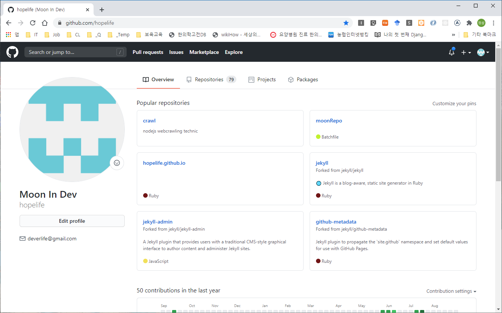
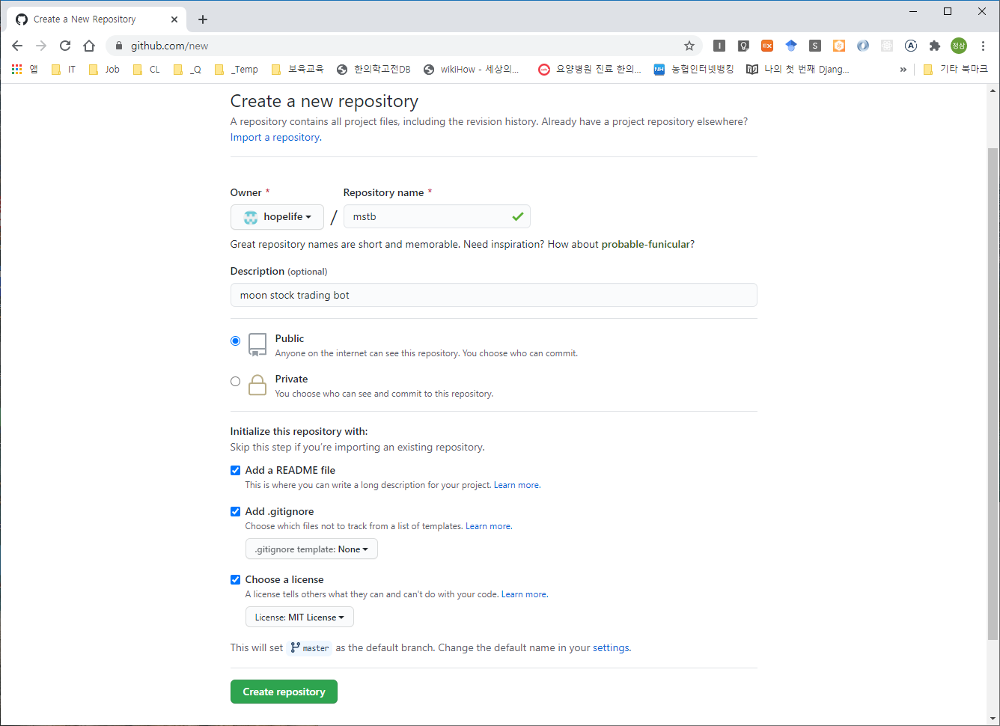
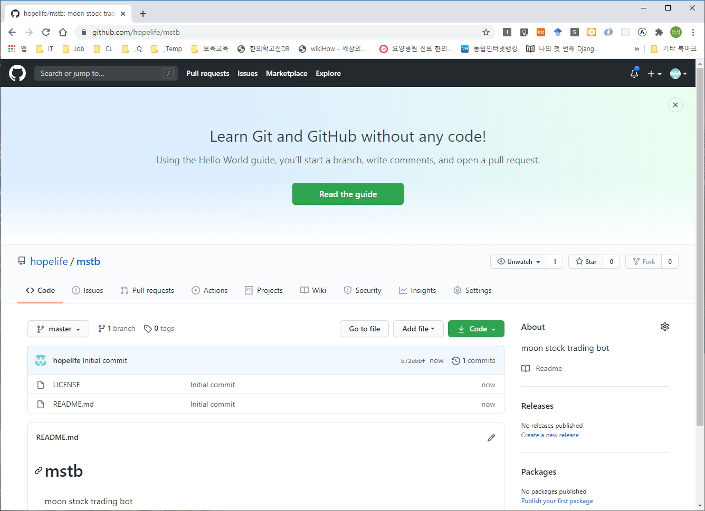

# breif
- moon stock trading bot


# reference
- book: 파이썬과 리액트를 활용한 주식 자동거래 시스템 구축
- git1: [https://github.com/wikibook/stock-trading](https://github.com/wikibook/stock-trading)
- git1: [https://github.com/helloalpaca/QuantBot](https://github.com/helloalpaca/QuantBot)


# dev environment
- OS: windows10 / OSX
- language: python, nodejs, react
- DB: mongoDB
- editor: visual studio code
- vcs: git, github


# initial setting

## github repository

### remote

- Create a new repository





### local

- clone
```
C:\> cd C:\dev\projects
C:\dev\projects\> git clone https://github.com/hopelife/mstb.git
```

## visual studio code
- 
-


# create stock account

## ebest
- [https://m.ebestsec.co.kr/](https://m.ebestsec.co.kr/)
- [https://www.ebestsec.co.kr/](https://www.ebestsec.co.kr/)

### 이베스트 마인 빅데이터 주식앱(개좌개설)
#### 스마트폰
- 이베스트 마인 설치
- 신규 계좌 개설
- 이베스트 마인 > 공인인증서 발급
- 모의투자 신청


#### PC
- 공인인증서 복사(스마트폰 -> PC)
- 공인인증서 로그인
- xingAPI 패키지 설치(C:\eBEST\xingAPI)
- 통합 홈트레이딩시스템(HTS) 설치

### Download Res Files

- open DevCenter
- download res files

## unittest
(ml32) C:\dev\projects\mstb> python -m unittest tests.test_agent_ebests


# 공공데이터 수집(p71)

- data.go.kr
- 한국예탁결제원_기업정보서비스


# install mongoDB(p108)
- https://www.mongodb.com/
- https://www.mongodb.com/try/download/community


# install pymongo
```
C:\> cd C:\dev\projects\mstb
C:\dev\projects\mstb> conda activate ml32
(ml32) C:\dev\projects\mstb>pip install pymongo
```

# window scheduler batch file
- C:\dev\projects\mstb\scripts\start_data_collector_1d.bat
```
ECHO ============================
ECHO Conda Activate
@CALL "C:\ProgramData\Anaconda3\Scripts\activate.bat" ml32
ECHO ============================
ECHO Change Directory
cd C:\dev\projects\mstb
ECHO ============================
ECHO Execute Python
python -m stocklab.scheduler.data_collector_1d %*;
```

# python scheduler
```
(ml32) C:\dev\projects\mstb> pip install apscheduler
```