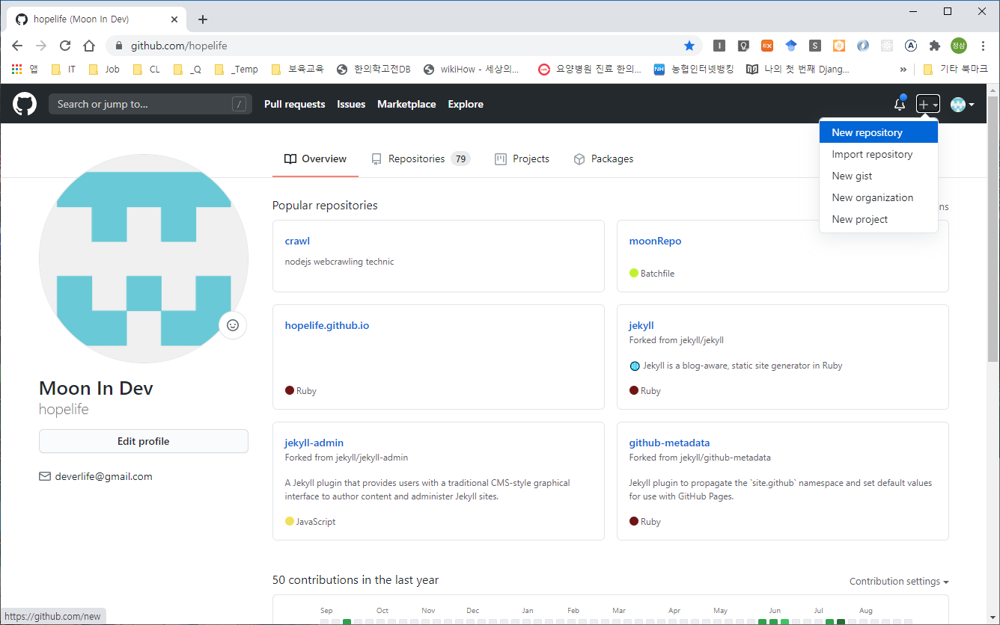
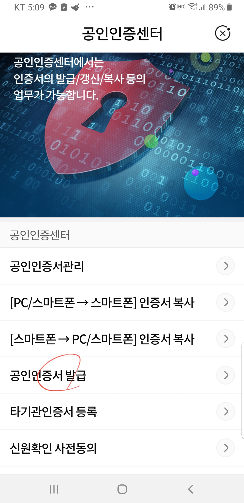

# breif
- moon stock trading bot


# reference
- book: 파이썬과 리액트를 활용한 주식 자동거래 시스템 구축
- git1: [https://github.com/wikibook/stock-trading](https://github.com/wikibook/stock-trading)
- git1: [https://github.com/helloalpaca/QuantBot](https://github.com/helloalpaca/QuantBot)


# dev environment
- OS: windows10 / OSX
- language: python, nodejs, react
- DB: mongoDB
- editor: visual studio code
- vcs: git, github


# initial setting

## github repository

### remote

- Create a new repository




### local

- clone
```
C:\> cd C:\dev\projects
C:\dev\projects\> git clone https://github.com/hopelife/mstb.git
```

## visual studio code
- 
-


# create stock account

## ebest
- [https://m.ebestsec.co.kr/](https://m.ebestsec.co.kr/)
- [https://www.ebestsec.co.kr/](https://www.ebestsec.co.kr/)

### 이베스트 마인 빅데이터 주식앱(개좌개설)
#### 스마트폰
- 이베스트 마인 설치
- 신규 계좌 개설
- 이베스트 마인 > 공인인증서 발급
- 모의투자 신청





#### PC
- 공인인증서 복사(스마트폰 -> PC)
- 공인인증서 로그인
- xingAPI 패키지 설치(C:\eBEST\xingAPI)
